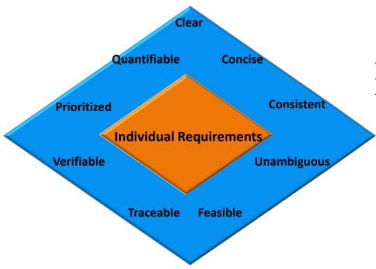

# Requirements Engineering

**Requirement** is a property that is exhibited by a software developed to solve a particular problem.

Requirement should specify **what** and **NOT** how.

### Properties of Requirements

- Due to limited budget and resources, choices have to be made on what to include and what to exclude.
- Factors such as changing customer needs, improved developer understanding of products affect the stability of requirements.
- Every requirement must be met. All necessary services must be present in final product.
- Changes in requirements should be done easily and consistently while retaining structure and style.
- Goals of should be realistic and achievable within given time taking into account the constraints set.

**Feasibility Study**: An analysis that takes into various factors such as technical, economical and legal and predicts the likelihood of a product being successfully delivered.