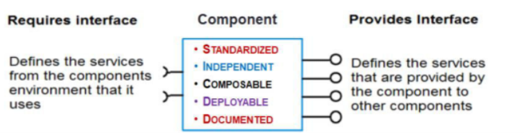

# Component Based Software Engineering - CBSE

It is a reuse-based approach to define, implement or select off-the-shelf components and integrate independent components into systems.

Motivation for CBSE:

- Increase in complexity of systems.
- Need a quicker Turn Around Time, reuse is better than re-implementing something that already exists and shorten development time.

### Advantages:

- Components are treated as a black box and hence reduces the complexity of the systems.
- Reduction in development time.
- Increase in productivity.

### Disadvantages:

- Component trustworthiness.
- Component certification.

### Essentials for CBSE:

- Standardised components that facilitate integration.
- Middleware that provides software support for integration.
- Development process geared towards CBSE.

## Software Component

Implements a functionality regardless of where it is being executed or the programming language.

It is an **independent executable entity** that can be in turn made up of multiple entities.

Has explicit dependencies and services it provides.

Identifying the component:

- Search
- Select
- If no component exist, create it with existing components. Can be sequential or may need some adapters or interfaces to work.
- Validate

#### Elements of a Component Model:

- **Interfaces**: Determines how a component can interact with other components and also determines operation parameters and names.
- **Usage**: Globally unique name or associated handle using which components can be named and distributed.
- **Deployment**: Specification on how components should be packaged for deployment as individual, executable entities.

# Product Lines

**Software Product Lines** are engineering principles for creating a portfolio of similar software systems using shared software assets.

**Product Line** is a family of manufactured products.

A **product line architecture** lets you capture the similarities in various software tools and also the differences to to customize software for various purposes while using common software assets.

Can be used as components and be looked at as design patterns.