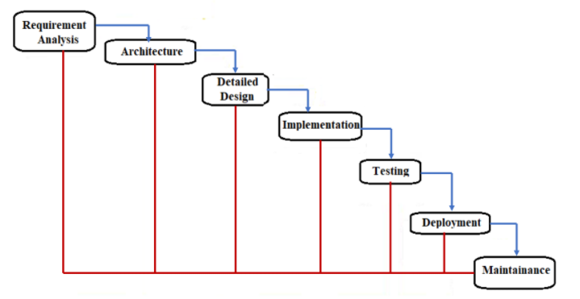
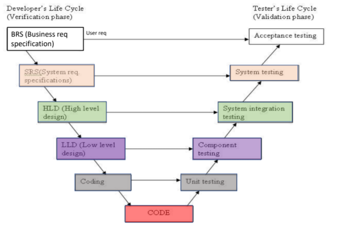
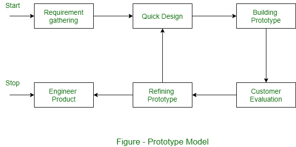
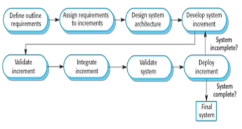

# Legacy SDLCs

## Waterfall Model

### Advantages:

- Simple. Clear and defined phases which are easy to control and departmentalize.
- Easy to manage (very structured and rigid).
- Each phase has specific deliverables and a review.

### Disadvantages:

- Assumes requirements are rigid and can be frozen.
- Difficult to accomodate change due to the rigid nature.
- Sequential, moves to another phase only after the current phase is done.
- No working software till late in the lifecycle.
- Bad for long, ongoing projects.

### Usage:

- Used in pure form for short projects where requirements are understood very well.
- Product definition is stable and technology is understood.

## V Model

Similar to the [Waterfall Model](#Waterfall-Model).

### Advantages:

- Test activities such as design testing and static testing can take place before implementation starts.

### Disadvantages:

- Similar to Waterfall Model.
- Software is only developed in the implementation phase and hence, no prototypes are made.
- Change in process results in change in Test Documentation as well.

### Usage:

- Similar to Waterfall Model.

## Prototyping

Instead of freezing the requirements before a coding/design round, a complete system prototype is built to understand the requirements.

Multiple prototypes can be built.

These prototypes are often **throw-away** or **evolutionary**.

### Advantages:

- Better understanding of requirements leads to better risk management.
- Problems/defects are identified earlier and hence reduce the cost.
- Missing functionality is easily identified.
- Systems are mostly stable.

### Disadvantages:

- May increase the complexity of the system as the scope of the system may go beyond the original plans.
- Performance of resulting system may not be optimal.

## Incremental Model

Requirements are partition and incremental plans are made.

Working version of software is developed in the first increment. Functionality is added to this in every increment.

Results in having a working piece of software early on in the lifecycle.

Continuous integration takes place till the complete system is developed.

Partition requirements can have their own lifecycle like [Waterfall](#Waterfall-Model) or [V Model](#V-Model).

### Advantages:

- Early versions can be developed to customers (Alpha, Beta releases).
- Flexible and cost effective as early versions can be used as prototypes and results in easy changes to scope and requirements.
- Easier to test and debug a small iteration or software functionality.
- Reduces unnecessary functionality as Essential features are added first.

### Disadvantage:

- Needs good planning and design.
- Needs clear and complete definition of the entire system as it has to be broken down into incremental parts before development starts.
- Total cost is higher than Waterfall.
- Management visibility is reduced only to current incrementation and could result in surprises.
- Hard to identify common resources that are needed by multiple increments.