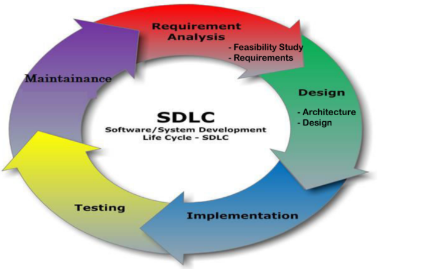
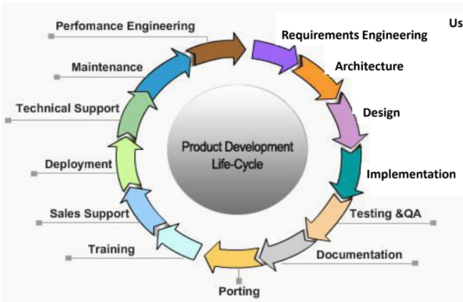
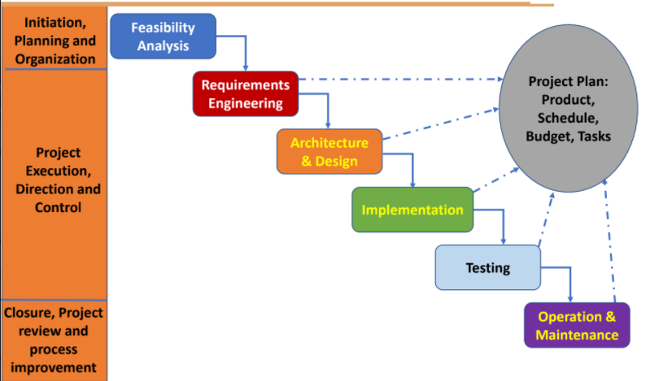
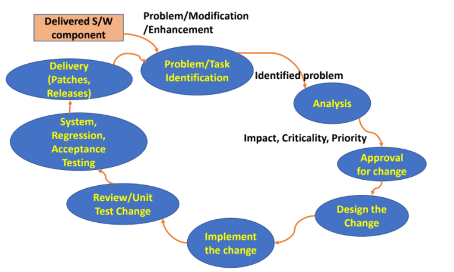
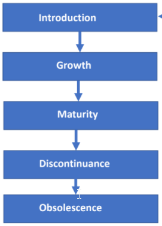
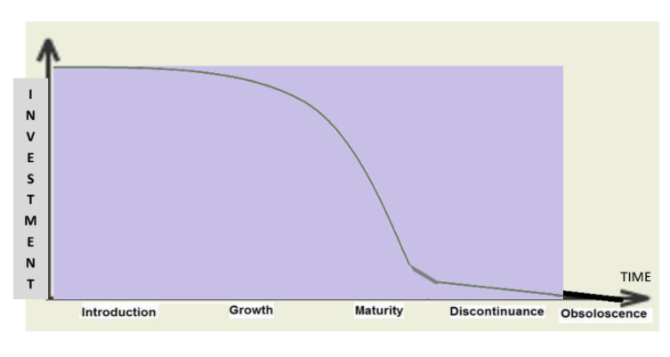

# Lifecycles

## SDLC - Software Development Life Cycle

Steps:

- **Requirement Analysis**: Analyse the requirements necessary, conduct a feasibility study to assess the practicality of the proposed software.
- **Design**: Design the software and its architecture.
- **Implementation**: Build the software taking into account the design and requirements.
- **Testing**: Testing the software built for any bugs.
- **Maintainance**: Fixing bugs or improving the software.

## PDLC - Product Development Life Cycle

## PMLC - Product Management Life Cycle

## SMLC - Software Maintainance Life Cycle

## Product Life Cycle

Steps:

- **Introduction**: Introduction of Product built using a [SDLC](#SDLC- Software-Development-Life-Cycle) into the market.
- **Growth**: Product grows and gains popularity and traction in the market.
- **Maturity**: Product attains market saturation and reaches its peak.
- **Discontinuance**: Product is on EOL Support and further development is discontinued.
- **Obsolescence**: Product is discontinued and is now considered to be "out of date" or "obsolete".

