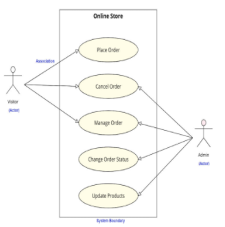

# Requirement Engineering

## Requirements Elicitation

Process of working with all stakeholders, gathering and understanding their needs, dealing with potential conflicts and thereby establishing a **clear scope and boundary** for this project.

Involves:

- Understanding the problem and domain.
- Identifying clear objectives.
- Understanding needs and constraints of the stakeholders.

### Elicitation Techniques

#### Active

There is ongoing interaction between stakeholders and users. Some examples are:

- Facilitated-Meetings
- Interviews
- Prototypes
- Scenarios

#### Passive

Infrequent interaction between stakeholders and users. Some examples are:

- Questionnares
- Checklists
- Documentation

## Requirements Analysis

- Understand the requirements in depth, both from a product and process perspective.
- Reorganise and resolve the conflicts.
- Prioritise the requirements. **MoSCoW**: Must have, should have, could have and won't have.
- Decide on Build or Buying and optimising for necessary requirements.

### Use Case Diagrams

- From a user's point of view, outlines how the proposed system will perform a task while responding to certain actions or requests.
- Can also be viewed as a sequence of actions a system is expected to perform to yield an observable result of value.
- Used to visualise and document the intended behaviour of a system during requirements analysis.

## Requirements Specification

Documentation of a set of requirements that is reviewed and approved by the customer for the next stage.
Basis for what the customers and contractors decided what to implement and what to not implement.

Documentation is required for the following reasons:

- Team Communication
- Maintainance and Evolution
- Formalisation leads to better clarity of points.
- Visibility for better project plan

Characteristics of documentation:

- Accurate and up to date.  
- Simple but professional.
- Maintained online.
- Appropriate for audience

### Software Requirement Specification (SRS)

- **Functionality**: What the software does
- **External Interfaces**: How the software interacts with other interfaces, people and devices.
- **Non-Functionality**: All of the quality criterias which drive the functionality such as performance, availability, portability, etc.

## Requirements Validation

- Purpose is to ensure that the requirement does what the customer wants it to do.