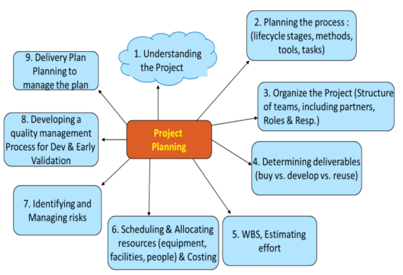

# Software Planning

### Understanding the Project

- Understand the needs of the customers, the stakeholders and the market.
- Support by results of Feasibility Study and Requirements Elicitation.

### Planning the Process

- Choosing a lifecycle.
- Choosing methods and tasks to follow during the development.
- What standards or guidelines should be met.
- Identifying tools to be used

### Organising the Project

- Determing the structure of the teams.
- Determining the structure of the organisation (flat, heirarchical, etc.).
- Setting up roles and responsibilities for each member.
- Identification of partners (localisation, sales and support, product marketing)

### Determining Deliverables

- Choosing between **Buy vs Develop vs Reuse**.

### WBS - Work Breakdown Structure

- Split projects into tasks.
- Combine taks to form specific phases. 
- Entry/Exit Criteria for each task.

### Estimation of Effort

- Can use techniques like **Delphi**, **Modified Delphi**.

##### Constructive Cost Model - CoCoMo

- **Organic**: Team size is small, have experience in similar problems, well understood problem.
- **Large**: Large team size, very complex, need people with sufficient experience.
- **Semi-detatched**: In between these two.

**Effort = ab (Kilo Lines of Code) bb Person Months**

### Scheduling and Allocating Resources

- Calendarisation of the work activities that are received from [WBS](#wbs---work-breakdown-structure) and [Estimation of Effort](#estimation-of-effort).
- Bringing all concerned individuals to participate in building this schedule.
- Identification and allocation of resources to the broken down projects.
- Organising tasks concurrently to maximise productivity.
- Minimise task dependencies to reduce delays.
- Cost in terms of budget, capital and expenses.
- Taking care of holidays, resource availability, etc.  

### Identifying and Managing risks

- **Risk** is an unexpected event that can affect people, resources, or technology involved.
- Idenfitication of the risk (what can go wrong).
- Assessment and analysis of the risk and its affects (probability and impact).
- Mitigation and fall back plans (what can we do).
- Identification of the Trigger (how we know the risk happened).

### Developing a quality management process

- Plans for tracking the progress of the project.
- Test completion criteria.
- Quality assurance plans.

### Plans for tracking Project Plan and Delivery Plan

- Plans for managing the project plan.
- Procedures to be followed before releasing the product to the consumer.