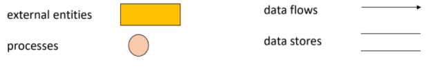
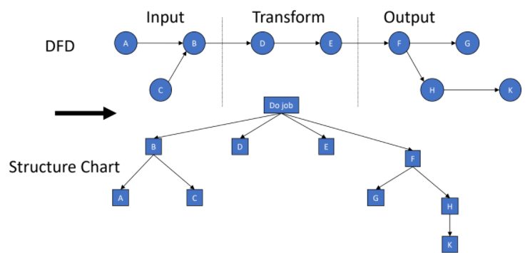

# Software Design

- Design is the smaller picture of implementation methodology (architecture is bigger picture), with local constraints on different parts of the system.

- Design faces implementation (architecture is strategy), is more concrete.

- Design is internal to a system (architecture is external) and focuses on problem solving.

- Design has more influence on functional requirements (arch is non-functional).

Detailed design involves:

- Further decomposition of products being developed.
- Identification and description of the behaviour of sub-components.
- How interfaces are going to be built using algorithms and data structures.
- How system will facilitate user interaction via UI.

## Design Enabling Techniques

#### Abstraction

Focuses on essential properties and ignores details that are not relevant for the problem and hence reduces the complexity.

#### Modularity, Cohesion and Coupling

**Modularity**: extent to which overall system and be broken down into smaller modules.

**Cohesion**: Extent to which modules are dependent on/fit into each other. Needs to be **strong**.

**Coupling**: How strongly one module is connected to one another. Change of one module impacts the others. Needs to be **loose**.

#### Information Hiding

**Encapsulation**: Hides data and allows access only through specific functions/methods.

**Separation of Implementation and Interface**: Allows us to change implementation without touching interface.

#### Limiting Complexity

**Complexity** is the amount of effort required to build the solution to a problem.

**Intra-modular**: Complexity of a single module is based on size (Lines of Code).

**Inter-modular**: Complexity between different modules. Based on size and various other measures.

## Key isses to be considered

#### Concurrency

- Parallel execution of one or more tasks within a program.
- Can give rise to deadlocks and race conditions.

#### Event Handling

- **Events**: messages sent between objects.
- Need event handlers to handle these.

#### Hardware Software Mapping

- Need to understand whether a subsystem is to be realised in hardware or software.
- Figure out how they are going to be connected (physically and logically).

#### Distribution of Components

- How various components of a distributed application will communicate with each other and also the possibility of a connectivity breakdown between these components.

#### Error, Exception Handling and Fault Tolerance

- **Error**: mistake in code that leads to code crashing or unexpected output, must be handled.
- **Exception**: unexpected event that occurs during program flow, needs to be handled.

## Data Flow Diagram (DFD)

Has two steps:

- **Structured Analysis (SA)**: logical design, drawn as **data flow diagram**.
- **Structured Design (SD)**: transforms logical structure into program structure as a set of **structure charts**.

Components of a DFD are:

- **External Entities**: source/dest. of a transaction.
- **Processes**: transform the data.
- **Data Flows**: paths where data travels between processes.
- **Data Stores**: Lie between processes.

## Design Patterns

TODO

## Service Oriented Architecture

SOA is a software design methodology that combines various discrete software modules, also known as services to provide functionalities of a larger, more complex software application.

Idea comes from **separation of concern**, which is the breaking down of one large problem into a series of problems or concerns.

A **service** is a logical representation of a repeatable business activity which has a specific outcome such as providing weather data or checking a credit card.

Are implemented as discrete pieces of software that are **callable entities** or functionalities that can be accessed via messages (or events).

Characteristics of Services:

- Services adhere to a communication agreement, i.e., a protocol.
- Services are loosely coupled and minimise dependencies.
- Services are stateless, leads to minimisation of resource utilisation.
- Services are autonomous, no external entity controlling them.
- Service abstraction, world does not need to know how it does the task, only what it does.
- Interoperability.
- Reusable and use open standards (Open Source).