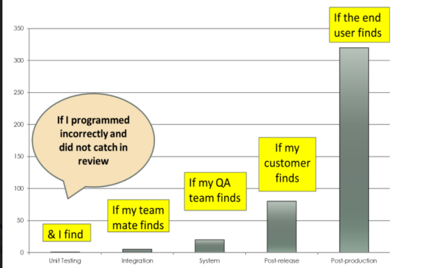

# Introduction to Software Implementation

[Context](./Context.md)

**Software Construction/Implementation**: It is the detailed creation of working software through coding, reviews and unit testing.

Fundamental **goals** when constructing/implementation:

- Minimising Complexity
- Anticipating Change
- Constructing for verification
- Reuse
- Construction for others to read

Implementation has a **development environment** which can be integrated or discrete. It is a structure designed for holding code and also has a **Software Configuration Management** system designed to manage the development of the same.

### Characterising Software Construction

- Construction produces a large number of configuration items such as source files and test cases.
- It is also very tool heavy as it heavily relies on compilers, debuggers, etc.
- It is related to software quality as code is the ultimate deliverable.
- Makes extensive use of Computer Science knowledge such as Algorithms, coding practices among others.

### Choice of Programming Language depending on Level of Abstraction

- **Assembly Languages**: Map directly to the CPU Architecture.
- **Procedural Languages**: modest level of abstraction from the underlying hardware.
- **Object-Oriented Languages**: break away from CPU architecture and abstract the machine by enabling the developer and designer to think about the project only in terms of **objects**.
- **Aspect-Orientation**: supported by various languages that allow the developer to separate various aspects from each other in a program. Done by adding additional behaviour to code without modifying the code itself.

### Development Environment

- Choice in selecting development and implementation environments which are restricted by the choice of language, methodology and application.

Other factors are:

- **Commercial vs Open-Source**: Developers prefer open-source but organisations are sceptical of open-source's capability and trustworthiness.
- **Support of Development Process**: Ensures that tools such as debuggers, test builders and tools for analysis are available.
- Security
- Integration with various tools
- Access to future capabilities

### Coding

Begins once the development environment is chosen. 
The later a bug is caught, the more expensive it is to fix the bug.

The above figure shows how expensive it is to fix a bug depending on who catches it.

#### Thoughts to keep in mind while Programming

- Program is for programmer who reads it, not the computer that runs it.
- Program is written once but modified many times.
- Minimise the complexity of the code which is written.

