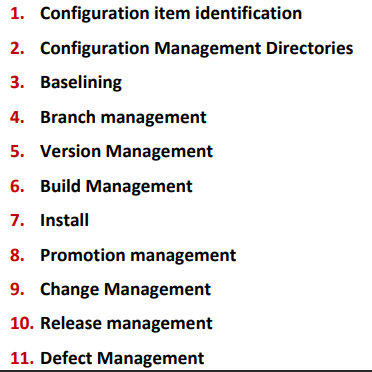

# Software Configuration Management

- **SCM** is the process to **systematically organise, manage and control** changes in the documents, code and other entities which are outcomes of different phases of the Software Eng process.
- Goal is to increase productivity by increased coordination between members of a team leading to less confusion and mistakes.
- Involves identiftying individual elements and configurations, tracking changes and version selection among others.

### Why is SCM necessary?

- Multiple people working on the project simultaneously and updating the same.
- Working on more than one version of the software.
- Working on released systems.
- Changes in configuration items due to change in user requirements, budgets, schedule, etc.
- Code/software must run on different OSs.
- Controlling costs involved in making changes to the system.

### SCM in Scrum-Agile

SCM is the responsibility of the **whole team** and needs to be automated as much as possible.

- **Definitive** versions of the project are held in a shared repository.   
- Developers copy this to their own workspace, make changes to code and a new system is built on their computer for testing.
- Once the developer is happy with the changes made, modified version is returned to the project repository, making it available to other team members.

### Benefits of SCM

- Permits orderly development.
- Orderly release of new/revised software.
- Only **approved changes** to new and existing software is implemented and deployed.
- Ensures documentation accurately reflects updates.
- Prevents unauthorized changes from being made.

### Configuration Management Roles

- **Configuration Manager**: Responsible for identifying configuration items and defining the procedures for promoting and creating new releases.
- **Change Control Board (CCB) Member**: Responsible for approving and rejecting changes.
- **Developer**: Creates versions triggered by change requests. Checks in changes and resolves conflicts.
- **Auditor**: Responsible for validating the processes followed for selection and evaluating promotions for release. Ensures consistency and completeness of the release.

### Configuration Management Activities

### Configuration Item Detection

- **Configuration Item**: Independent or aggregation of hardware, software, or both, that is designated for configuration management and treated as a single entity in the SCM process. 
**Eg**: Code files, manuals, system configurations, drivers for tests, etc.

- Large projects can have thousands of entities that can be uniquely identified and brought under configuration management.

As not all items are under SCM, leads to two challenges:

- **Selection**: Need to select the right configuration items. Some items need to be maintained for software lifetime.
- **Timing** (when to place under SCM): Too early leads to too much bureaucracy. Too late leads to too much chaos.

### SCM Directories

- **Programmer's Directory (IEEE Dynamic)**: Library for holding newly **created or modified** software entities. Controlled **only** by the programmer.
- **Master Directory (IEEE Controlled)**: Manages current baseline(s) and changes to them. Entry is controlled and has to be verified. Changes **must** be authorised.
- **Software Repository (IEEE Static)**: Archive for baselines released. Copies will be made available to requesting organisations.

### Baselines

**Baseline** is a specification/product that has been formally reviewed and agreed upon and serves as the basis for further development. Can only be changed through formal change control procedures.

- **Baseline A**: APIs have been completely defined, bodies of methods need to be filled.
- **Baseline B**: methods have been implemented and tested.