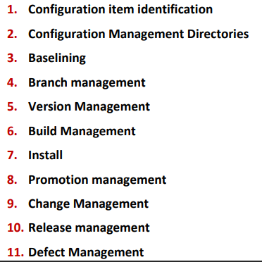

# Software Configuration Management

- **SCM** is the process to **systematically organise, manage and control** changes in the documents, code and other entities which are outcomes of different phases of the Software Eng process.
- Goal is to increase productivity by increased coordination between members of a team leading to less confusion and mistakes.
- Involves identiftying individual elements and configurations, tracking changes and version selection among others.

### Why is SCM necessary?

- Multiple people working on the project simultaneously and updating the same.
- Working on more than one version of the software.
- Working on released systems.
- Changes in configuration items due to change in user requirements, budgets, schedule, etc.
- Code/software must run on different OSs.
- Controlling costs involved in making changes to the system.

### SCM in Scrum-Agile

SCM is the responsibility of the **whole team** and needs to be automated as much as possible.

- **Definitive** versions of the project are held in a shared repository.   
- Developers copy this to their own workspace, make changes to code and a new system is built on their computer for testing.
- Once the developer is happy with the changes made, modified version is returned to the project repository, making it available to other team members.

### Benefits of SCM

- Permits orderly development.
- Orderly release of new/revised software.
- Only **approved changes** to new and existing software is implemented and deployed.
- Ensures documentation accurately reflects updates.
- Prevents unauthorized changes from being made.

### Configuration Management Roles

- **Configuration Manager**: Responsible for identifying configuration items and defining the procedures for promoting and creating new releases.
- **Change Control Board (CCB) Member**: Responsible for approving and rejecting changes.
- **Developer**: Creates versions triggered by change requests. Checks in changes and resolves conflicts.
- **Auditor**: Responsible for validating the processes followed for selection and evaluating promotions for release. Ensures consistency and completeness of the release.

### Configuration Management Activities

### Configuration Item Detection

- **Configuration Item**: Independent or aggregation of hardware, software, or both, that is designated for configuration management and treated as a single entity in the SCM process. 
**Eg**: Code files, manuals, system configurations, drivers for tests, etc.

- Large projects can have thousands of entities that can be uniquely identified and brought under configuration management.

As not all items are under SCM, leads to two challenges:

- **Selection**: Need to select the right configuration items. Some items need to be maintained for software lifetime.
- **Timing** (when to place under SCM): Too early leads to too much bureaucracy. Too late leads to too much chaos.

### SCM Directories

- **Programmer's Directory (IEEE Dynamic)**: Library for holding newly **created or modified** software entities. Controlled **only** by the programmer.
- **Master Directory (IEEE Controlled)**: Manages current baseline(s) and changes to them. Entry is controlled and has to be verified. Changes **must** be authorised.
- **Software Repository (IEEE Static)**: Archive for baselines released. Copies will be made available to requesting organisations.

### Baselines

**Baseline** is a specification/product that has been formally reviewed and agreed upon and serves as the basis for further development. Can only be changed through formal change control procedures.

- **Baseline A**: APIs have been completely defined, bodies of methods need to be filled.
- **Baseline B**: methods have been implemented and tested.

### Branch Management

**Codeline**: Progression of a set of source files and other artifacts, which make up software components that change over time. 

**Branch**: Copy or clone of all or a portion of source code within the repository. It is a copy of a codeline.

Reasons for branching:
- Concurrent development.
- Multiple versions of a solution.
- Developers can experiment in isolation. Working without impacting others.

**Merging** is integrating the changes in a particular branch so all the users can access these changes. 
Branching can be done by customer, developer, module, etc. 

### Version Management

**Version Management**: Process of keeping track of different versions of software components and the systems in which they are used. Can be done with tools like Git.

- Changes to a version are identified by a number known as the **revision** number.

Features of version management: 

- Changes are attributable or traceable due to the revision number.
- Change history is recorded so can revert back to a previous version if necessary.
- Better conflict resolution. 
- Easier code maintenance and quality monitoring.

### Build Management

**Build Management**: Process of creating the application for a release by linking all the relevant source code files and libraries and compiling them, to build the artificats such as binary files and executable files.

- Could involve finding all the components, compiling, linking and then sanity checking the binary files.
- Done with tools such as Maven, Apache ANT, Make, etc.
- Consists of compilation of various files in the **correct** order and then linking them in the **appropriate** order.
- If source code in a file has not changed, does not need to be recompiled.

### Install Management

Software installation is the first interaction that developers have with a new user. **Impactful** in terms of customer experience. Failure of an installation will lead to a negative perception.

- Can also involve interaction with the OS, to get validation of permissions and resources needed and to ensure enforcement of license and registration.

### Promotion Management

Changes made by programmer will only be present in the programmer's environment and will be promoted to a central master directory based on promotion policies.
  Promotion will be based on some baselining criteria and will include verification for meeting that criteria. Once approved, will be moved to central master directory and will be available to other modules.

### Change Management

A change could result in the creation of a different version or release of software. Deals with changes to CIs that have been baselined.
 
General change process:

- Change is requested.
- Given a unique identification number.
- Change is assessed for impact to other modules.
- Change is either accepted or rejected.
- If accepted, implemented and then validated.

 

- **Complexity of Change management depends on project**: For smaller projects, change requests are informal and fast. 

    - For complex projects, require detailed change request forms and approval from a CCB Member.

- **Information required**: Description of proposed changes. Reason for making changes. Items affected by the changes.
- **Tools, resources and training required to form assessment**: File comparison tools to identify changes. 

