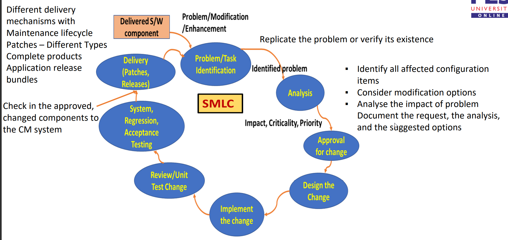

# Software Maintenance

- Largest portion of the total life cycle as products are used for a long period of time. Includes discontinuance as well.

- **Maintenance** is the process of modifying a piece of software system or component after release to correct faults, improve performance or other attributes.
- It is done to ensure the product continues to satisfy user needs. Commitment to customers to support the software that they have invested in.
- The **maintainer** could be an organisation or a person responsible for carrying out maintenance activities.

## Expected Maintenance Activities

- Maintaining control over day-to-day functioning.
- Maintaining control over software modifications
- Perfecting existing functions
- Preventing software to degrade to below acceptable levels.

## Actions that support Maintenance

- Understanding product and module to be supported by studying architecture, design, code, test cases etc.
- Talking with developers and architects
- Good documentation, testable code.
- Analyse consequences of solution and how it will affect future maintenance activities.

## Maintenance Costs

- Consumes major share of the software lifecycle financial resources.
- 70% of finance goes to maintenance and 30% goes to development.
- Factors affecting costs are:

    - Maintenance staff availability
    - Lifespan
    - Quality of design, construction, testing and documentation.

## Key Issues

#### Technical

- Code and Documentation Quality
- Limited understanding due to newer and lower-skilled people
- Availability of test environment to reproduce problems
- Impact Analysis on change

#### Management

- Staffing and retaining people with the right skills
- Alignment with economic interests as management has a very low RoI
- Outsourcing the maintenance to other organisations bring their own problems such as protection of IP, quality control, scope of maintenance.

#### Cost

- Application type
- Staff availability
- Lifespan
- Quality

## Categories of Maintenance

- **Preventive Maintenance**: Modification of software after delivery to correct latent faults before they are discovered (become effective faults).

    - Corrective and proactive

- **Perfective Maintenance**: Modification of software after delivery to improve performance or maintainability.

    - Proactive and enhancement

- **Corrective Maintenance**: Modification of software performed after delivery to correct detected problems.

    - Reactive and corrective

- **Adaptive Maintenance**: Modification of software after delivery to keep product usable in a changed environment.

    - Reactive and enhancement

## Reverse Engineering

- Process of recovering specification and design information from the source code.
- Identifies the components of software and interrelationships between the components.
- Purpose is to create representation of the software in a format that is not the code or documentation.
- Often represented in graphs and control flow graphs.

## Re-Engineering

- Process of modifying software to make it easier to understand and maintain. Done at a reasonable cost.
- Done when it is no longer viable to employ standard maintenance techniques with reasonable efficiency and productivity.
- **May** involve refactoring.
- Re-engineered code should have lower cpu utilisation, improved readibility, performance and usability.