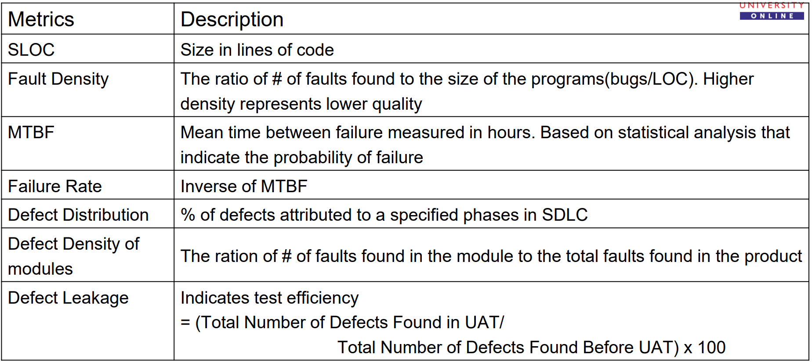
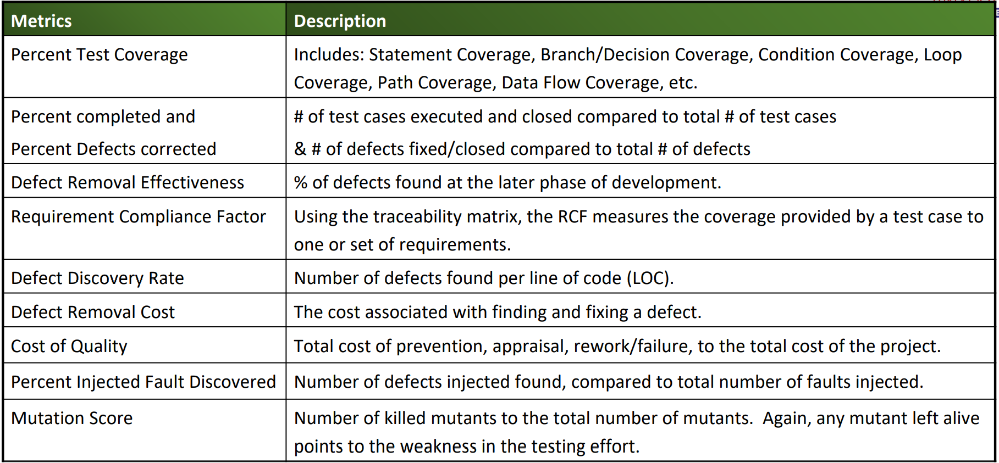
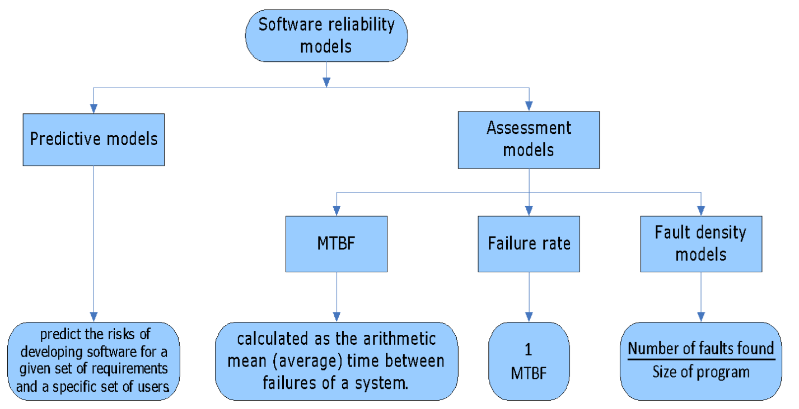

# Software Test Metrics

- Quantitative measure of testing process indicating the quality, productivity and degree to which a system and system components possess that attribute.

Goal of testing metrics is:

- Improve the effectiveness and efficiency in the software testing process.
- Help make better decisions for future testing processes by providing reliable data about the testing process.

Measurements help increase the effectiveness of the testing process

- When used as part of project planning and monitoring to optimise planning, executing and monitoring of the test activities.
- Provides data that can be used to determine the quality of the product being tested.
- Helps in defect analysis

These measures can represent the quality of the product and also the test coverage and thoroughness of the test.

## Characteristics

- **Quantitative**: Metrics must be quantitative and be expressed in values.
- **Understandable**: Should be easily understood and clearly defined.
- **Applicability**: Should be applicable even in the initial stages of software development.
- **Repeatable**: Values should be the same when measured repeatedly and be consistent in nature.
- **Economical**: Computation of the metric should be economical.
- **Language Independent**: Should not be dependent on any programming language.

Metrics should be looked at from the following **perspectives**:

- **Product** measures Eg: complexity
- **Process** measures targeted to improve the efficiency of processes Eg: `Test cases designed/phase`
- **Project progress** Eg: `Time spent/number of test cases`

## Software Test Measures - Product Related

## Software Reliability

**Software Reliability** is the probability of failure-free software operation for a specified period of time in a specified environment.

## Test-Driven Development (TTD)

- First write tests, then do the design or implementation.

Steps associated: 

1) Add a test
2) Run this and earlier tests, see if system fails
3) Make a change and add something to make the test work
4) Continue incrementally till all planned tests run properly
5) Refactor system to improve design and reduce dependencies

## Test Case Selection

Methods to prioritise test cases include:

- Highest priority requirements to be tested first
- Complex code to be tested first
- Large modules to be tested first
- Test most frequently modified module