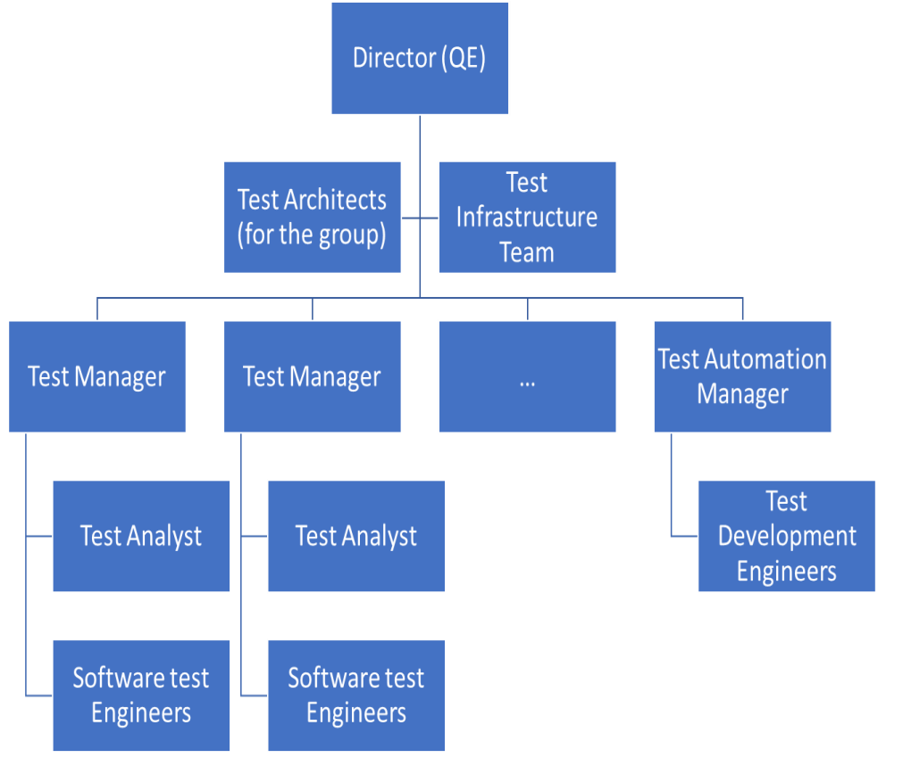

# Structure of Testing Organisation

- Software Testing is part of the Quality Engineering department and hence done in the QE Organisation.

## Roles and Responsibilities

- **Test Director**: Oversight, co-ordination, strategic vision, high-level consumer and stakeholder connect.
- **Test Manager**: Prepares test strategy, plans for product, monitors and controls the testing process.
- **Test Infrastructure Manager**: Manages infrastructure of the testing teams, capacity planning, maintenance, support, etc.
- **Test Automation Management**: Manges development of tools and scripts for automating tests.
- **Test Architect**: Designes test infrastructure, picks the appropriate tools, helps drive the requirments for tools. Validates the test strategy.
- **Test Analyst**: Mapping of customer enviroment and features to testing conditions and documentation.
- **Software Test Engineer**: Tests the products or projects system outcomes using planned techniques and tools.
- **Test Development Engineer**: Develops tools and scripts for automated testing.

## Test Process

- Testing is a process and has a lifecycle with different steps.

1) **Planning and Control**

    - Identifying the requirements.
    - Creating test strategy, planning for resources, building a schedule.

2) **Design**

    - Identifies test conditions and designs tests and test environment.

3) **Implementation and Execution**

    - Develop test cases, data and test automation.
    - Execute tests, collect metrics and log results.

4) **Evaluate Exit Criteria and Reporting**

    - Evaluate the test completion, stopping criteria based on functionality and objectives.

5) **Test Closure**

    - Done when testing is complete or project is cancelled.
    - Verify all the deliverables are met and issues are resolved.

