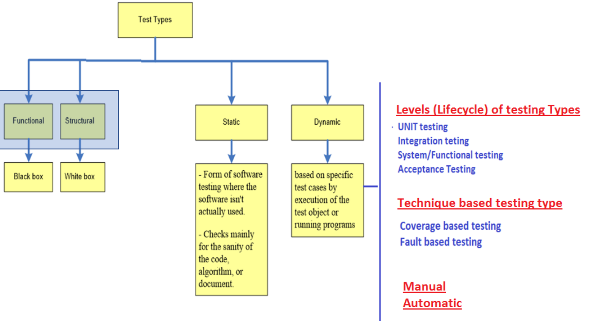
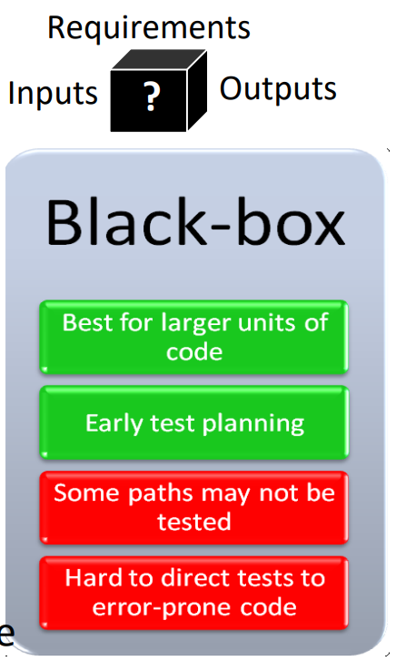
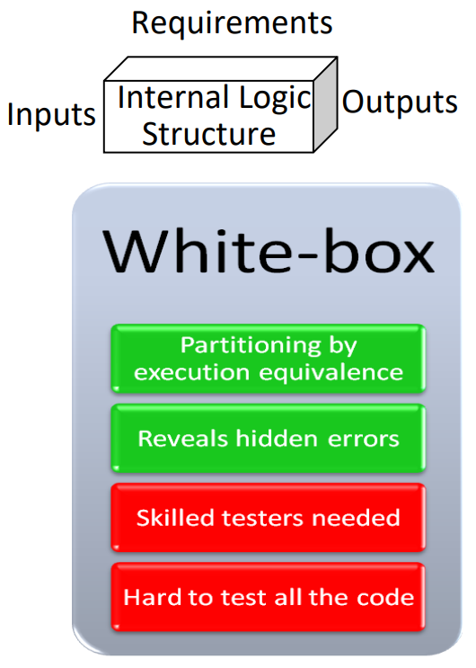
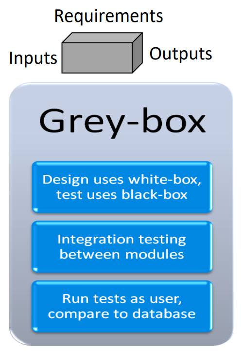

# Types of Testing

Testing can be characterised based on Functional and Structural approaches taken.

## Black Box Testing (Functional)

- Treats the software as a black box without any regard to the internal logic or implementation.
- Concerned with the **external** behaviour.
- Objective is to find defects in output as a result of both valid and invalid inputs.
- Testing from **user's point of view**.

## White Box Testing (Structural)

- Takes into account internal logic and structure.
- Uses knowledge of internal structure to derive test cases.
- Test cases cannot be written till the code is written (unlike Black-Box).
- Testing from a **developer's point of view**.
- Tester needs programming skills.

## Grey Box Testing (Hybrid of Functional and Structural)

- Involves having access to internal algorithms and data structures to design the test cases.
- Testing is done at the **black-box level** or the **user-level**.

## Static Testing

- Detect defects in the software without actually running the code.
- Done in the earlier stages of development and can be fixed easily.

## Dynamic Testing

- Code is executed to analyse the behaviour.
- Input values are provided, output values is analysed for the observation.
- Can find difficult and complex issues that static analysis cannot.
- Time and Budget consuming.

Different kinds of Dynamic Testing like:

- Code or Fault based
- Approach used for testing
- Manual or Automatic
- Levels of Testing

### Code-Based Approaches

#### Control-Flow Testing

- A control-flow path is generated, which is a graphical representation of all the paths that a program can take during its execution.
- **Branch Coverage** where each path is executed at least once.

#### Data-Flow Testing

- Selects paths through the program's control flow in order to explore sequences of events related to the status of objects and variables.
- **Statement Coverage** where each statement is executed at least once.

### Fault-Based Approaches

#### Error Guessing

- Most plausible faults.
- Uses historical information and experience.

#### Fault Seeding

- Fault is injected into a copy of the code and tests are run.
- Other detected faults are also analyzed.

#### Mutation Testing

- Tests **seldom-executed** code.
- Single statement is changed multiple times to create mutants.
- Tests are run against original and mutants.
- All mutants should fail, in case any of the mutants pass, the test case is not good enough.

### Approach-Based

#### Specification-Based

- Tests the functionality of the system according to the specified requirements.
- Test the behaviour (output) of a system given a specific input.

#### Equivalence Partitioning and Boundary Value Analysis

- **Very important** as they can reveal **entire classes** of errors and reduce the number of test cases that must be developed and executed.

###### Equivalence Partitioning

- Divides input data into partitions of data from which test cases can be derived.
- Test cases are derived from each partition of the data.

##### Boundary Value Analysis

- Designed to include representatives of boundary values as they are common locations for errors that can result in software faults.

#### Intuition-Based

- Based on tester's experience (and intuition) of designing test cases for the product.

#### Usage Based

- Finds defects which *could be* revealed by user as they interact with the product.

#### Application Domain

- Use specific knowledge about the product domain to develop the test cases.

### Manual and Automatic Testing

#### Manual Testing

- Involves a human performing the tests step-by-step, **without** test scripts.
- Used for testing **complex tests** where automation can be expensive.
- Slow and tedious.
- Hard to get test coverage.

#### Automated Testing

- Involves tests which are executed **without** human assistance, done via test automation frameworks, along with other tools and software.
- Needs coding, test framework maintenance but is fast and repeatable.
- Most efficient for tests which need **periodic** running.

### Levels of Testing

#### Unit Testing

- Verifies the proper functioning of the smallest individual executable code units.
- No interaction between units.
- Done by the programmers.
- Done for coding/construction errors before it goes to QE.
- Could test Algorithms, Data Structures, Interfaces, Boundary conditions, etc.

#### Integration Testing

- Tests to verify the interfaces between various components in the software system.
- Done by programmers and can find issues like **timing problems** and **resource-contention** problems which cannot be detected by unit testing.
- Abstract units and look for defects between units.

Two possible strategies:

- **Big Bang**: Everything is integrated and then run to see if system is performing as expected.
- **Iterative**: Components belonging to corresponding elements of the architecture are integrated iteratively (allows quicker localisation of issues) either as a **Top-Down** or **Bottoms-Up** approach.

#### System Testing

- Tests a completely integrated system to verify it is compliant with specified requirements.
- Seeks to detect defects within the system as a whole and also inconsistencies with integrated units ("*inter-assemblages*").
- It is a type of **Black-Box** testing and is done after integration and before acceptance testing.
- Involves testing the end-to-end flow of an application as a user, and validating if the end features work fine. Tests are focused towards the **entire system**.

Has the following steps:

1) **Test Environment Setup**: Creating test environment.
2) **Create Test Case**: Generate test case.
3) **Create Test Data**: Generate data to be tested.
4) **Execute Test Case**: Execute the test case after test data and test case is generated.
5) **Defect Report and Logging**: Defects in the system are detected, logged and reported.

#### Acceptance Testing

- Running a suite of test cases on a **completed** system.
- Each individual test case, exercises a particular operating condition of a user's environment/feature.
- Designed to be similar or as close as possible to a user's environment.
- Test cases are created through collaboration between business customers, analysts, testers, developers. Need to include business logic validation as well as UI elements.
- Used to test the completeness of stories.
- Provides confidence that software meets business requirements and can also be a final stage to uncover any new bugs.

### Important Terms

- **Installation Testing**: Verifies installation in target environment.
- **Alpha and Beta Testing**: Pre-release testing done by a small, reperesentative set of users. In-House is **Alpha** and external is **Beta**.

    - Uncontrolled.

- **Performance Testing**: Aimed at verifying that software meets certain performance requirements. 