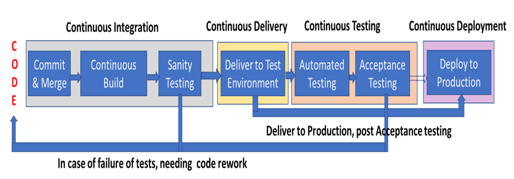

# DevOps Pipeline

## Continuous Integration (CI)

- Involves continuously merging the code written by devs with the master/main branch, multiple times throughout the day.
- Devs take a snap-shot of the main branch, create their new branch to work on their individual components. They then merge the changes back into the main branch. This is done by multiple devs at once.
- If any merge conflicts are found, they must be resolved.
- If infrequent code merging is not done, can lead to large scale conflicts and incompatibilities when a big merge is done, leading to higher costs, time and effort to resolve conflicts, and issue in build and run-time.

Has the following benefits:

- As changes are being merged continuously, conflicts will be small and easy to resolve.
- Issues are caught early on.
- Reduces debugging time.
- Avoids difficult integrations, increased visibility and communication.

Merged code needs to be **built**, post which needs to be validated for **Sanity**.

#### Continuous Build

- Build involves compiling, handling dependencies and generating executable product.
- Involves running static analysis tools like **Lint**.

#### Sanity Testing

- The executable is run with some sanity tests, to ensure good compilation and that the dependecies are resolved.

## Continuous Delivery (CD)

- Frequent shipping of code to a given environment.
- Post every merge, build and sanity test, newly integrated bits are ready to be deployed. Supports release of changes to test teams/customers in a sustainable way.
- Triggered by last step in the Integration process, supports delivery to either test or production environment.
- Supports faster time to market and higher quality products. Can also support **deploy on demand**.

